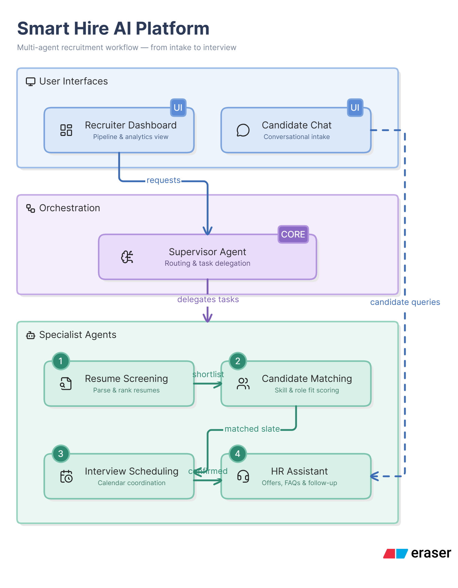
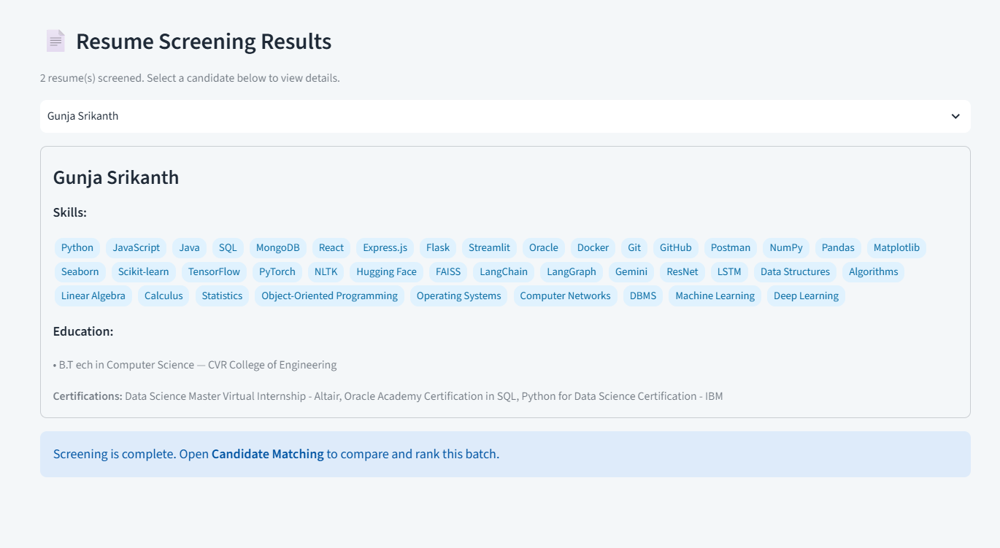
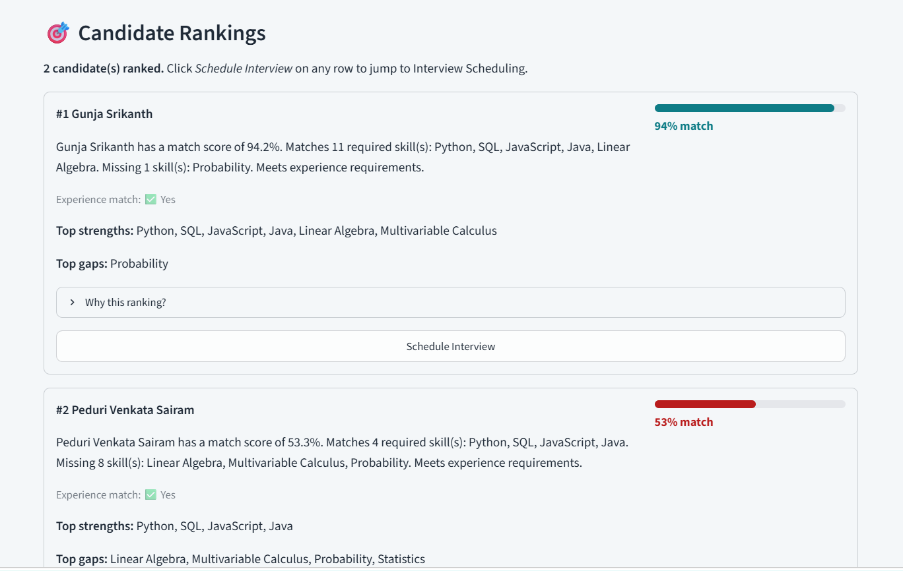
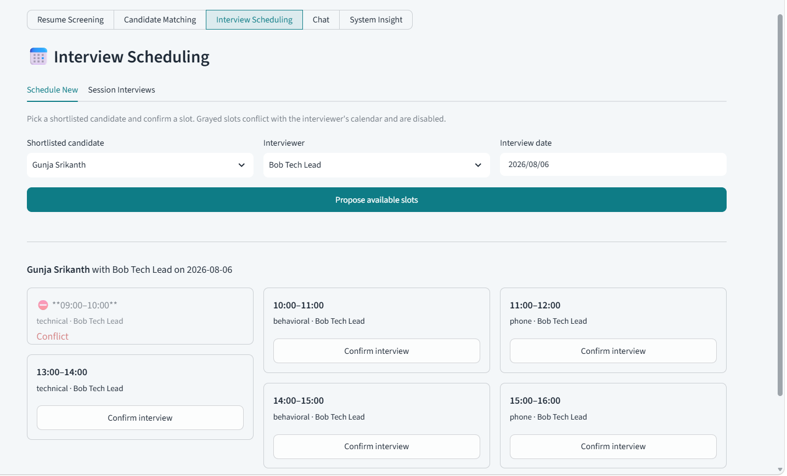
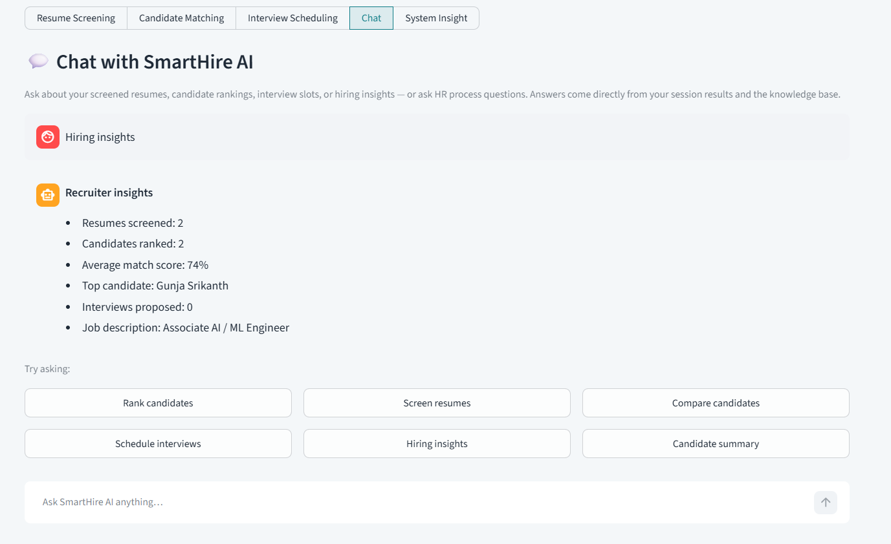
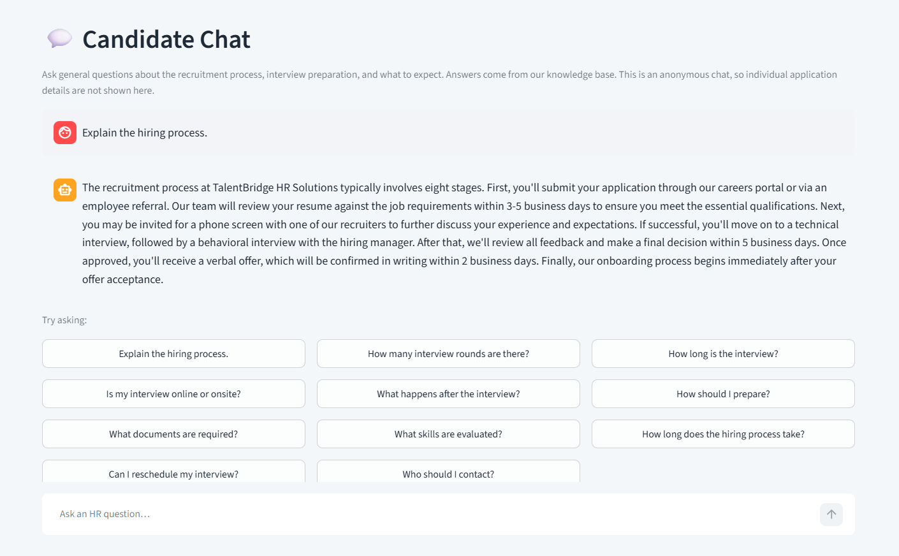

# SmartHire AI

**Multi-agent recruitment automation system** powered by LangGraph, LangChain, Streamlit, and SQLite.

SmartHire AI orchestrates a team of specialized AI agents to automate the end-to-end hiring workflow — from resume screening and candidate ranking to interview scheduling and HR Q&A. All conversation state and recruitment data persist to SQLite, so nothing is lost between sessions or app restarts.

---

## Table of Contents

- [Features](#features)
- [Tech Stack](#tech-stack)
- [Architecture](#architecture)
- [Quick Start](#quick-start)
- [How It Works](#how-it-works)
- [Agents](#agents)
- [Tools](#tools)
- [LangGraph Memory](#langgraph-memory)
- [LLM Provider Configuration](#llm-provider-configuration)
- [Frontend](#frontend)
- [Outputs](#outputs)
- [Performance](#performance)
- [Testing](#testing)
- [Development](#development)

---

## Features

- **Multi-agent pipeline** — Supervisor routes user intent to the right specialist agent(s) in the correct order
- **Resume parsing** — Extracts structured data (skills, experience, education, certifications) from PDF, DOCX, and TXT resumes
- **Async batch screening** — Resumes screen in parallel (`asyncio` fan-out with a concurrency cap) with live per-resume progress and a per-resume retry for failed documents
- **JD analysis** — Parses job descriptions into required/preferred skills, experience, and education requirements, concurrently with the screening batch
- **Candidate ranking** — Computes composite match scores with deterministic skill/experience overlap scoring, justified per candidate
- **Interview scheduling** — Proposes non-conflicting interview slots with calendar conflict detection and booking
- **HR Assistant** — Answers recruitment FAQs grounded in a role-aware knowledge base (`knowledge/recruitment.json`), with escalation for sensitive topics
- **Reflection Node** — Validates all agent outputs against a 4-point checklist before returning the final response
- **Session persistence** — Conversation history, agent state, uploaded documents, and recruitment data survive browser refreshes and app restarts via SQLite
- **Transient-error recovery** — If the LLM provider fails mid-pipeline (503/overload/timeout), the run pauses and resumes from the last checkpoint instead of losing work
- **Dual UI modes** — Recruiter Dashboard (screening, matching, scheduling, chat, insight) and Candidate Chat (HR questions)
- **LLM provider flexibility** — Runs fully local with Ollama + Llama 3.2 or remotely with Google Gemini; toggle in the sidebar
- **Persistent audit trail** — Every user/assistant/agent turn is logged to `chat_messages` for compliance and debugging
- **Skill normalization** — Handles LLM inconsistencies (category sentences, aliases, abbreviations) to produce accurate skill matching

---

## Tech Stack

| Component | Technology | Purpose |
|-----------|-----------|---------|
| Agent orchestration | **LangGraph** StateGraph | Multi-agent routing, conditional edges, state management |
| LLM framework | **LangChain** | Prompt templates, structured output, message types |
| LLM backend | **Ollama** (local) / **Google Gemini** (remote) | Inference for all agents |
| Async execution | **asyncio** | Parallel resume screening + concurrent JD analysis |
| State schema | **TypedDict** + Annotated reducers | Lightweight graph state with append semantics |
| I/O contracts | **Pydantic v2** BaseModel | Input/output validation for all agents |
| Frontend | **Streamlit** | Recruiter dashboard + candidate chat |
| Data handling | **Pandas** | Resume/JD tabular processing |
| Storage | **SQLite** | Recruitment data + LangGraph checkpointer |
| PDF extraction | **pypdf** | Resume PDF text extraction |
| DOCX extraction | **python-docx** | Resume DOCX text extraction |
| Package management | **uv** | Dependency resolution and virtual environments |
| Linting | **Ruff** | Code quality enforcement |
| Testing | **pytest** + **pytest-mock** | Unit and integration tests |
| Secrets | **python-dotenv** | `.env` file loading |
| Observability | **langsmith** + `utils/observability.py` | Execution logging / tracing hooks |

---

## Architecture



### Reflection Node — Validation Checklist

Before returning the final response, the Reflection Node validates:

1. **Candidate recommendations match JD** — Cross-checks ranked candidates' skills against JD requirements. Flags fabricated skills (skills claimed in `skills_match` that don't appear in the extracted resume data). Triggers a correction retry from Candidate Matching if issues are found.

2. **Interview schedules conflict-free** — Detects overlapping slots for the same interviewer. Drops conflicting slots and triggers a correction retry from Interview Scheduling.

3. **All questions answered** — Compares the original user query against agent outputs in state. Flags unanswered questions rather than silently dropping them.

4. **Clarity and consistency** — Combines all agent outputs into a single, polished final_response via an LLM polish pass (or deterministic fallback).

When validation fails on the first pass, the graph loops back to the responsible agent with `reflection_feedback` for a single correction attempt. The second pass returns the result to the user with any remaining issues surfaced rather than hidden.

---

## Quick Start

Two ways to set up: **uv** (recommended) or **venv + pip**.

### Option A — uv (recommended)

[`uv`](https://docs.astral.sh/uv/) is a fast Python package manager that handles virtual environments and dependency resolution automatically.

```bash
# 1. Clone the repository
git clone <repository-url>
cd smarthire-ai

# 2. Create the virtual environment and install all deps (incl. dev tools)
uv sync

# 3. Create your local model configuration
Copy-Item .env.example .env

# 4. Start Ollama (local Llama 3.2 backend) if you don't already have it running
ollama serve

# 5. Launch the app
uv run streamlit run app.py
```

### Option B — venv + pip

Standard Python tooling — works everywhere Python 3.11+ is installed.

```bash
# 1. Clone the repository
git clone <repository-url>
cd smarthire-ai

# 2. Create a virtual environment
python -m venv .venv

# 3. Activate the virtual environment
# Windows (PowerShell):
.venv\Scripts\Activate.ps1
# Windows (cmd):
.venv\Scripts\activate.bat
# macOS / Linux:
source .venv/bin/activate

# 4. Install all dependencies
pip install -r requirements.txt

# 5. Install dev dependencies (optional, for testing/linting)
pip install pytest pytest-mock ruff

# 6. Create your local model configuration
# Windows (PowerShell):
Copy-Item .env.example .env
# macOS / Linux:
cp .env.example .env

# 7. Start Ollama (local Llama 3.2 backend) if you don't already have it running
ollama serve

# 8. Launch the app
streamlit run app.py
```

### Using Gemini Instead

Edit `.env` and set:

```dotenv
LLM_PROVIDER=gemini
GEMINI_API_KEY=your_api_key_here
GEMINI_MODEL=gemini-2.5-flash
```

### App Output

The app opens at `http://localhost:8501`. The SQLite schema (`db/smarthire.db`) is created automatically on first run and is idempotent (`CREATE TABLE IF NOT EXISTS`). No manual database setup is required.

---

## How It Works

### Recruiter Workflow

1. **Upload resumes** — Drop PDF, DOCX, or TXT files. The Resume Screening tab retains the original documents per session (downloadable, restorable across restarts).

2. **Provide a JD** — Upload a file, paste text, or use the bundled sample JD (Senior Full-Stack Developer). The JD Analyzer extracts required skills, preferred skills, experience requirements, and education.

3. **Screen** — Click "Run Resume Screening" in the **Resume Screening** tab. Resumes screen in parallel; a live progress view grows as each document finishes (successes + any failures). Failed documents stay visible with a per-resume "retry screening" button. Screening is a pure extraction-and-evidence step — no comparison happens here.

4. **Rank** — Switch to the **Candidate Matching** tab and click "Rank Screened Candidates". The Candidate Matching agent compares the screened batch against the JD, computes composite scores, and ranks them. The Reflection Node validates the ranking; its status is shown in an expandable section.

5. **View results** — See ranked candidates with match score meters, skill strengths/gaps, experience match, and justification.

6. **Schedule interviews** — Click "Schedule Interview" on any ranked candidate to jump to the Interview Scheduling tab. Pick a date, select an interviewer, and confirm available slots. Conflicting slots are grayed out. Confirmed interviews appear in the session list and can be cancelled.

7. **Chat** — Ask follow-up questions about candidates, policies, or the process. The recruiter chat answers directly from your stored session results (screening/rankings/slots/insights) or the HR knowledge base — it never re-runs the pipeline.

8. **System Insight** — View session metrics: resumes screened, active session, average match score, and interviews proposed.

### Candidate Workflow

Candidate chat is an anonymous, general Q&A. Candidates can ask about the recruitment process — interview rounds, duration, mode, preparation, required documents, what happens after an interview, hiring timeline, rescheduling policy, and who to contact. The HR Assistant answers directly from the role-aware knowledge base (`knowledge/recruitment.json`) without running the recruiter pipeline, never invents individual statuses or interview details, and escalates to human HR for sensitive topics (legal, accommodation, discrimination).

---

## Agents

### Supervisor (`supervisor.py`)

- **Responsibility:** Intent detection and routing
- **LLM structured output:** `ExecutionPlan` (intent, agents_to_invoke, reasoning)
- **Fallback:** Keyword-based classification when LLM is unavailable
- **Never processes data** — only routes to specialist agents

### Resume Screening Agent (`agents/resume_screening_agent.py`)

- **Responsibility:** Parse a batch of resumes and extract structured data
- **Output:** `ResumeScreeningOutput` — candidate name, skills, experience years, education, summary, match score
- **Async batch:** `screen_batch_async()` screens resumes concurrently (semaphore-capped fan-out) and reports progress per resume; failures are returned per-document so the UI can retry just that file
- **Grounding:** Skills are extracted by both LLM and text-level vocabulary scan (`skill_normalizer.py`), then deduplicated
- **Persistence:** Writes to `candidates` and `screenings` tables

### Candidate Matching Agent (`agents/candidate_matching_agent.py`)

- **Responsibility:** Rank screened candidates against the JD
- **Output:** `CandidateMatchingOutput` — ranked list with scores, skill matches/gaps, experience match, justification
- **Scoring:** Deterministic composite score (skills 70%, experience 30%), reconciled against LLM output
- **Reflection-aware:** Accepts `reflection_feedback` for correction retries
- **Persistence:** Writes to `candidate_rankings` table

### Interview Scheduling Agent (`agents/interview_scheduler_agent.py`)

- **Responsibility:** Propose non-conflicting interview slots
- **Output:** `InterviewSchedulingOutput` — proposed slots with status (proposed/confirmed/conflict), conflicts list, summary
- **Conflict detection:** Reuses `CalendarTool._has_conflict()` for overlap detection
- **Persistence:** Writes to `interviews` table

### HR Assistant Agent (`agents/hr_assistant_agent.py`)

- **Responsibility:** Answer candidate or recruiter recruitment FAQs grounded in the role-aware knowledge base
- **Output:** `HRAssistantOutput` — answer, sources, confidence (0-1), needs_escalation flag
- **Role-aware:** Candidate answers come only from `knowledge/recruitment.json` topics and never leak recruiter-side workflow data; recruiter answers also use live session context (rankings, slots)
- **Escalation:** Automatically escalates legal, accommodation, discrimination, and contract questions
- **Persistence:** Writes to `hr_answers` table

### Reflection Node (`agents/reflection_node.py`)

- **Responsibility:** Validate all agent outputs before the final response
- **Checks:** (a) candidate skills vs JD, (b) schedule conflicts, (c) all questions answered, (d) clarity/consistency
- **Retry:** One correction retry per turn — loops back to the responsible agent with feedback
- **Persistence:** Stamps reflection results onto `candidate_rankings` rows

---

## Tools

### Resume Parser (`tools/resume_parser.py`)

LLM-based structured extraction from raw resume text. Supports PDF (via pypdf), DOCX (via python-docx), and TXT files. Supplements LLM output with text-level skill extraction to prevent skill deduplication issues with small local models.

### JD Analyzer (`tools/jd_analyzer.py`)

Extracts structured requirements from job description text: job title, required/preferred skills (atomic names, not category sentences), experience range, and education requirements.

### Calendar Tool (`tools/calendar_tool.py`)

JSON-backed interview calendar at `data/interview_slots.json`. Supports availability checking, conflict detection, slot booking, and available slot proposal. Used by both the Interview Scheduling Agent and the Streamlit scheduling UI.

### Skill Normalizer (`tools/skill_normalizer.py`)

Handles LLM skill extraction inconsistencies:
- Expands grouped entries (e.g., "Languages: Python, SQL, Java" → individual skills)
- Resolves aliases (e.g., "sklearn" → "scikit learn")
- Matches skills with light containment (e.g., "javascript" matches "javascript/react")
- Extracts skills from raw text via vocabulary scan as a safety net

### Candidate Database (`tools/candidate_database.py`)

SQLite-based read/query layer for candidate records. Supports search by name, skills, and experience. Used by the HR Assistant for candidate lookups.

### Email Notification (`tools/email_notification.py`)

Log-based stub for interview invitations and status updates. Logs email actions that would be sent in production. Supports real SMTP integration in future phases.

---


## LangGraph Memory

### Conversation State

The shared graph state (`SmartHireState` in `memory/state.py`) is a TypedDict with Annotated reducers:

| Field | Type | Reducer | Purpose |
|-------|------|---------|---------|
| `conversation_history` | `list[BaseMessage]` | `operator.add` (append) | Accumulates messages across turns |
| `user_role` | `str` | overwrite | `'recruiter'` (default) or `'candidate'` — drives role-aware routing |
| `current_intent` | `str` | overwrite | Supervisor's classified intent |
| `active_agents` | `list[str]` | overwrite | Agent queue for this turn |
| `requested_workflow` | `str` | overwrite | UI-directed workflow (`screening` / `matching`) for direct routes |
| `resumes` | `list[dict]` | overwrite | Screened resume data |
| `screening_failures` | `list[dict]` | overwrite | Per-resume failures (kept visible in the UI) |
| `resume_inputs` | `list[dict]` | overwrite | Raw resume documents |
| `candidate_availability` | `list[dict]` | overwrite | User-supplied scheduling constraints |
| `candidate_rankings` | `list[dict]` | overwrite | Ranked candidates |
| `job_description` | `dict` | overwrite | Parsed JD data |
| `interview_slots` | `list[dict]` | overwrite | Proposed interview slots |
| `hr_answers` | `list[dict]` | overwrite | HR Assistant responses |
| `reflection_notes` | `dict` | overwrite | Validation results and issues |
| `reflection_validated` | `bool` | overwrite | Whether the Reflection Node passed |
| `reflection_attempts` | `int` | overwrite | Bounds the retry loop to one correction pass |
| `retry_agent` | `str \| None` | overwrite | Agent to loop back to on validation failure |
| `reflection_feedback` | `str \| None` | overwrite | Feedback consumed by the retried agent |
| `final_response` | `str` | overwrite | Polished response for the user |
| `error` | `str` | overwrite | Non-empty if any agent errored |

### Checkpointer Integration

```python
from memory.conversation_memory import get_checkpointer, get_thread_config

checkpointer = get_checkpointer()  # SqliteSaver over db/smarthire.db
compiled = graph.compile(checkpointer=checkpointer)

config = get_thread_config(session_id)  # {"configurable": {"thread_id": session_id}}
result = compiled.invoke(input_state, config=config)
```

LangGraph restores the previous checkpoint automatically using the stable `thread_id`. On resume, only the new user message is passed as input (the checkpointer restores prior history, avoiding duplication via the append reducer).

### Session Lifecycle

1. **Create** — `ConversationMemory().create_session(mode)` generates a UUID-based session id
2. **Resume** — `resume_last_session()` returns the most recently active session from the `sessions` table
3. **Reset** — `reset_session()` clears working data while retaining the session identity
4. **Clear** — `clear_session()` erases all data (memory + checkpointer + session row)

The `ChatAudit` class maintains a small mirror file (`data/active_session.local`) so browser refreshes can resume the same conversation.

---

## LLM Provider Configuration

The application reads `.env` at startup via `utils/llm_factory.py`:

### Local (Ollama) — Default

```dotenv
LLM_PROVIDER=ollama
OLLAMA_MODEL=llama3.2
OLLAMA_BASE_URL=http://localhost:11434
```

### Remote (Google Gemini)

```dotenv
LLM_PROVIDER=gemini
GEMINI_API_KEY=your_api_key_here
GEMINI_MODEL=gemini-2.5-flash
```

`.env` is gitignored. For deployment, inject environment variables via your platform.

---

## Frontend

Built with Streamlit using an enterprise teal theme (`.streamlit/config.toml`).

### Recruiter Dashboard (5 sections)

| Section | Description |
|---------|-------------|
| **Resume Screening** | Upload resumes + JD, run the screening workflow, view per-candidate profiles with retry for failures |
| **Candidate Matching** | Rank the screened batch against the JD with score meters and reflection summary |
| **Interview Scheduling** | Pick candidates, select interviewers, propose/confirm slots with conflict detection |
| **Chat** | Chat with SmartHire AI — answers come from stored session results or the HR knowledge base |
| **System Insight** | Session metrics: resumes screened, active session, avg match score, interviews proposed |

### Candidate Chat

A separate mode for candidates to ask HR questions about the recruitment process. Answers come from the role-aware knowledge base and never expose recruiter-side data.

### UI Features

- **Agent-aware chat** — Each agent turn is badge-labelled with its agent
- **Live progress** — Per-agent stage checklist shows pending/running/done during pipeline execution; the screening batch shows a growing live dropdown as each resume finishes
- **Per-resume retry** — Failed documents stay visible with a "retry screening" button that re-screens only that file
- **Score meters** — Color-coded match score bars (teal ≥80%, amber ≥60%, red <60%)
- **Reflection summary** — Expandable section showing validation checks, corrections, and retry status
- **Pause & resume** — A transient provider error pauses the run; a Resume button continues from the last checkpoint
- **Session persistence** — Past sessions listed in the sidebar, switchable with full state restore; uploaded files survive restarts and are downloadable

---

## Outputs

Sample results from the app, shown in the `outputs_results/` directory.

### Recruiter Dashboard

**Resume Screening**



**Candidate Matching**



**Interview Scheduling**



**Recruiter Chat**



### Candidate Chat

**Candidate Chat**



---

## Performance

End-to-end timings measured with a batch of **2 resumes**. Exact times depend on hardware, model size, and prompt lengths.

| Stage | Ollama (Llama 3.2) | Gemini |
|-------|--------------------|--------|
| Resume Screening | 5–6 minutes | 2–3 minutes |
| Candidate Matching | 2–3 minutes | 1–2 minutes |

---

## Testing

**With uv:**

```bash
uv run pytest              # full suite
uv run pytest -v           # verbose output
uv run pytest tests/test_skill_normalizer.py   # specific file
uv run ruff check .        # lint
```

**With pip (virtual env activated):**

```bash
pytest                     # full suite
pytest -v                  # verbose output
pytest tests/test_skill_normalizer.py   # specific file
ruff check .               # lint
```

---

## Development

### Adding a Dependency

**With uv:**

```bash
uv add <package-name>
```

This updates `pyproject.toml` and `uv.lock`. Then sync:

```bash
uv sync
```

**With pip:**

```bash
# Activate your virtual environment first, then:
pip install <package-name>
pip freeze > requirements.txt
```

> `requirements.txt` is kept in sync for compatibility, but `pyproject.toml` + `uv.lock` are the source of truth.

### Running Individual Agents

Each agent has a `__main__` block for standalone testing. Pass a resume/JD file path explicitly (sample data is not shipped in the repo):

**With uv:**

```bash
uv run python agents/resume_screening_agent.py path/to/resume.txt path/to/job_description.txt
uv run python agents/candidate_matching_agent.py path/to/job_description.txt
uv run python tools/resume_parser.py path/to/resume.txt
uv run python tools/jd_analyzer.py path/to/job_description.txt
```

**With pip (virtual env activated):**

```bash
python agents/resume_screening_agent.py path/to/resume.txt path/to/job_description.txt
python agents/candidate_matching_agent.py path/to/job_description.txt
python tools/resume_parser.py path/to/resume.txt
python tools/jd_analyzer.py path/to/job_description.txt
```

### Graph Smoke Test

**With uv:** `uv run python graph.py`

**With pip:** `python graph.py`

Runs a full pipeline with a sample HR question against the real LLM.

