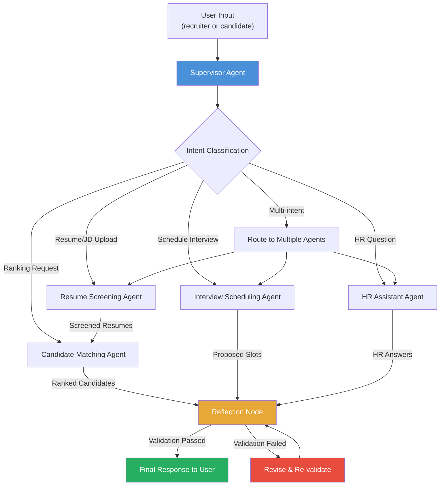
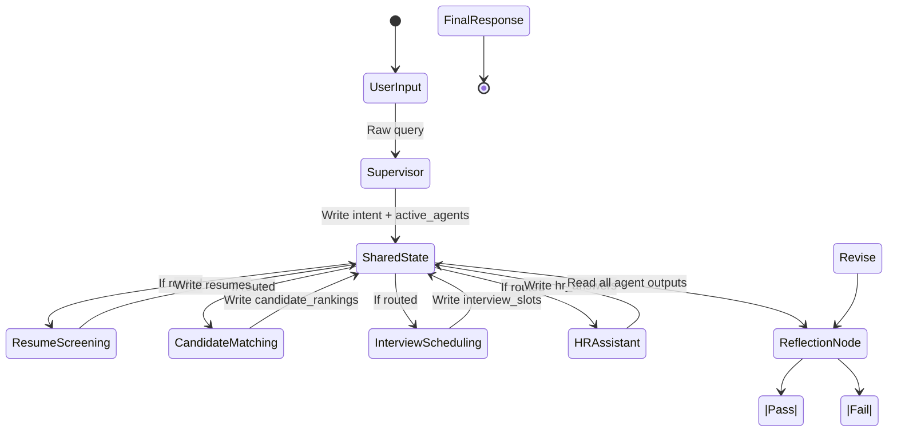

# SmartHire AI — Architecture

## High-Level Workflow

---

## Agent Responsibilities

### Supervisor Agent

**Single responsibility:** Intent detection and routing. The Supervisor receives the raw user query, classifies its intent (resume screening, candidate matching, interview scheduling, HR question, or multi-intent), and decides which specialist agents to invoke and in what order. It writes the `current_intent` and `active_agents` fields to shared state.

**Tools it will call:** None directly — it delegates to other agents via the graph's routing edges.

**What it does NOT do:** It never processes resumes, ranks candidates, schedules interviews, or answers HR questions itself. It is purely a router.

### Resume Screening Agent

**Single responsibility:** Parse a resume (PDF, DOCX, or plain text) and extract structured data: candidate name, skills, years of experience, education history, and an initial match score against the job description. Writes results to the `resumes` field in shared state.

**Tools it will call:** `tools/resume_parser.py` (text extraction and structured field extraction), `tools/jd_analyzer.py` (to understand JD requirements for scoring).

**What it does NOT do:** It does not rank candidates against each other (that's Candidate Matching), schedule interviews, or answer questions. It processes one resume at a time.

### Candidate Matching Agent

**Single responsibility:** Take a list of screened resumes and a parsed job description, compute a composite match score for each candidate, rank them, and produce a justified ranking list. Writes results to the `candidate_rankings` field in shared state.

**Tools it will call:** `tools/candidate_database.py` (to retrieve stored candidate data if needed).

**What it does NOT do:** It does not parse resumes (that's Resume Screening), schedule interviews, or answer HR questions. It operates on already-screened data.

### Interview Scheduling Agent

**Single responsibility:** Given a list of candidates and availability data, propose non-conflicting interview slots, detect scheduling conflicts, and assign interviewers. Writes results to the `interview_slots` field in shared state.

**Tools it will call:** `tools/calendar_tool.py` (availability checks, conflict detection, booking).

**What it does NOT do:** It does not screen resumes, rank candidates, or answer HR questions. It only handles scheduling logistics.

### HR Assistant Agent

**Single responsibility:** Answer candidate or recruiter recruitment FAQs — policy questions, process guidance, general HR knowledge. Escalates to human HR when the question is outside its scope. Writes results to the `hr_answers` field in shared state.

**Tools it will call:** `tools/email_notification.py` (to send status updates if needed), internal policy knowledge base.

**What it does NOT do:** It does not make hiring decisions, process resumes, rank candidates, or schedule interviews. It provides information and guidance only.

---

## Supervisor Routing Logic

The Supervisor classifies the user's intent using the following decision tree:

1. **Resume/JD upload detected** (file attachment, "review this resume", "parse this CV") →
   Route to `Resume Screening Agent`, then chain to `Candidate Matching Agent` if a JD is also present.

2. **Ranking/matching request** ("rank candidates", "who's the best fit", "compare applicants") →
   Route to `Candidate Matching Agent` (assumes resumes are already screened or available in state).

3. **Scheduling request** ("schedule interview", "find available slots", "book a time") →
   Route to `Interview Scheduling Agent`.

4. **General HR question** ("what's your policy on", "how does the process work", "tell me about") →
   Route to `HR Assistant Agent`.

5. **Multi-intent** (message contains multiple distinct requests) →
   Route to multiple agents in sequence: Resume Screening → Candidate Matching (if resume + ranking), or Interview Scheduling + HR Assistant (if scheduling + question).

6. **Greeting/filler** ("hello", "thanks", "okay") →
   Route to `HR Assistant Agent` for a conversational response.

The Supervisor writes its decision to `current_intent` and `active_agents` in shared state. The graph uses conditional edges to dispatch to the appropriate agent nodes.

---

## Reflection Node — Validation Checklist

The Reflection Node runs **after** all agents complete and **before** the final response is returned to the user. It validates the combined agent outputs against the following checklist:

### Candidate Recommendation Validation

- [ ] Every candidate recommendation is based **only** on resume content and JD requirements — no fabricated skills, experience, or qualifications.
- [ ] No candidate is ranked higher without a specific, traceable justification tied to JD requirements.
- [ ] Match scores are derived from actual skills/experience overlap, not arbitrary assignments.
- [ ] The response is phrased as a **recommendation**, never as a final hiring decision.

### Interview Scheduling Validation

- [ ] No two interview slots overlap for the same interviewer (conflict detection).
- [ ] All proposed slots fall within business hours and reasonable timeframes.
- [ ] Each scheduled candidate has at least one slot assigned.

### Response Completeness Validation

- [ ] All questions from the original user query were addressed in the response.
- [ ] If the user asked multiple things, each part has a corresponding answer or acknowledgment.
- [ ] No agent output was silently dropped — all relevant data is reflected.

### Clarity and Consistency Validation

- [ ] Response is free of jargon and uses clear, professional language.
- [ ] Formatting is structured (bullet points, tables, or sections as appropriate).
- [ ] Actionable next steps are included where applicable.
- [ ] No contradictions between different agents' outputs in the combined response.

### Escalation Validation

- [ ] If any agent flagged `needs_escalation: true`, the response includes a note that human HR review is recommended.
- [ ] If the system cannot answer a question with confidence, it says so explicitly rather than guessing.

---

## State Flow Diagram

---

## Technology Stack

| Component | Technology | Purpose |
|-----------|-----------|---------|
| Agent orchestration | LangGraph StateGraph | Multi-agent routing and state management |
| LLM | Ollama + gemma4 | Local inference for all agents |
| State schema | TypedDict + Annotated reducers | Lightweight graph state |
| I/O contracts | Pydantic v2 BaseModel | Input/output validation |
| Frontend | Streamlit | Recruiter dashboard + candidate view |
| Data handling | Pandas | Resume/JD tabular processing |
| Storage | SQLite / ChromaDB | Long-term candidate memory (bonus) |
| Package management | pip + requirements.txt | Dependency management |
| Linting | Ruff | Code quality enforcement |
| Testing | pytest + pytest-mock | Unit and integration tests |
